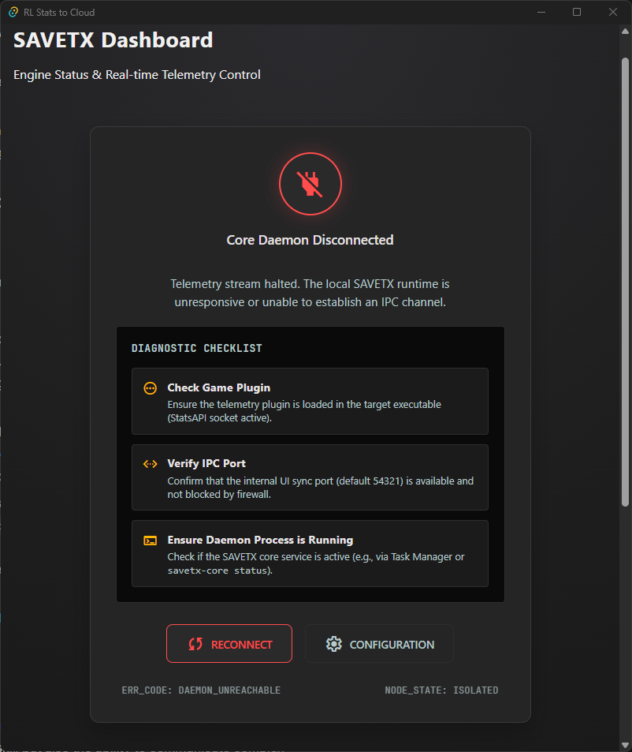

# RL Stats to Cloud

A Rust workspace ingesting Rocket League telemetry over a multi-lane pipeline, pushing live state,
event feed, and historical match data to Firebase — with a Tauri v2 desktop UI for real-time monitoring
and configuration.

## Architecture

```
Game Source (ws://127.0.0.1:49123)
        │
        ▼
┌─────────────────────────┐
│  rl_stats_core          │  ◄── TCP control ──  rl-stats-to-cloud (Tauri)
│  Core Service           │       43210            │
│                         │                        │
│  ┌──────────────────┐   │  WebSocket (54321)     │
│  │ UI Sync Server   │───┼──────────────────────► │
│  └──────────────────┘   │   state updates        │
│                         │                        ▼
│  ┌──────────────────┐   │               ┌──────────────┐
│  │ Ingestion Engine │───┼──────────────►│  Firebase    │
│  └──────────────────┘   │   HTTP/PUT    │  Realtime DB │
└─────────────────────────┘               └──────────────┘
```



## Quick Start

```bash
# Start the Core Service
cargo run -p rl_stats_core

# In a separate terminal, launch the Tauri desktop app
bun run tauri dev
```

## Workspace Layout

```
Cargo workspace (Rust edition 2024)
├── core/         rl_stats_core — Core Service binary + library
└── src-tauri/    rl-stats-to-cloud — Tauri v2 desktop client

Frontend: Bun + Vite 6 + TypeScript 6 + Zod 4 (SPA, WebView-hosted)
```

## Reliability Model

| Lane | Channel Type | Delivery Semantics | Backpressure Behaviour |
|------|-------------|-------------------|----------------------|
| **LiveState** | `watch` (single value) | At-most-once, deduplicated by seq | Always overwrites; oldest cedes to newest |
| **EventFeed** | `mpsc` (bounded, cap 2048) | At-most-once, best-effort | Drops when full; max 3 send retries |
| **Historical** | `mpsc` (bounded, cap 8192) | At-least-once, lossless | Infinite retry with exponential backoff (full jitter, 1s–32s) |

The Ingestion Engine cannot stall: Historical backpressure never blocks LiveState or EventFeed.
See [docs/pipeline.md](docs/pipeline.md) for the full data plane specification.

## Documentation

- [Architecture](docs/architecture.md) — service boundaries, IPC, ports, configuration
- [Data Pipeline](docs/pipeline.md) — ingestion, classification, sink actors, retry policies
- [Operations](docs/operations.md) — CLI control, lifecycle management, auto-timeout
- [Development](docs/development.md) — validation, linting, dependency management
- [ADR: Three-Lane Pipeline](docs/decisions/0001-three-lane-pipeline.md) — why we split telemetry
